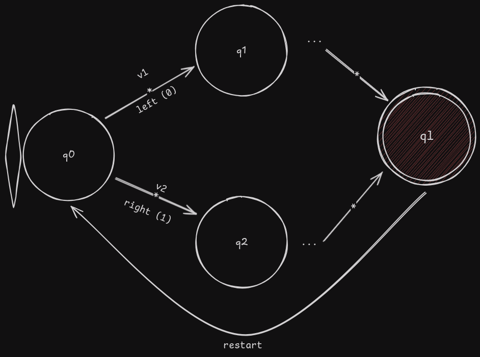

# Reinforcement Learning para CartPole

O objetivo dessa atividade era o de criar um algoritmo de reinforcement learning para a execução do CartPole usando o ambiente de simulação do Gym.

## Instalação das bibliotecas

Para inciar a atividade, foi necessário fazer a instalação das bibliotecas do Gym que permitissem o uso do ambiente de simulação pré configurado. A versão mais atualizada do Gym se chama Gymnasium, e essa distribuição foi instalada usando o instalador de pacotes pip, dentro de um ambiente virtual python (venv).

```bash
pip install "gymnasium[all]"
```

## Código da biblioteca

Dentro do arquivo [lib.py](./lib.py), foram definidas todas as funções necessárias para a execução do ambiente de treinamento. Algumas entidades foram abstraídas em classes e suas definições foram elencadas abaixo:

- Algorithm: Enumerador com diferentes algoritmos de reinforcement learning (Q-learning ou SARSA)
- QTable: Q-Table para salvar o aprendizado durante cada episódio
- State: Estado dentro do ambiente de execução
- Agent: Agente de reinforcement learning

Para mais informações sobre os métodos que cada uma dessas entidades possuem, verifique a documentação presente na biblioteca. 

# MDP 

O processo de decisão de Markov para o caso do CartPole foi descrito abaixo:



**Obs.:** O número de estados depende da **precisão**, um fator que será explicado na seção posterior.

Cada estado fornece as seguintes características:

- Posição do carrinho
- Velocidade do carrinho
- Ângulo do pole
- Velocidade angular do pole

O estado inicial é determinado pela seed fornecida, que, para o treinamento, foi fixada. A mudança de estado é feita através da escolha de uma ação dentro do conjunto de ações disponíveis, que para a CartPole são esquerda (representada pelo número 0) e direita (representada pelo número 1). A cada mudança de estado, existe uma política da atualização do valor do Q-table, que será discutida também na próxima seção do documento, mas que tem a função de dar pesos para as escolhas nos próximos episódios.

Quando o ângulo do pole excede um valor de aproximadamente 24° em relação à normal, ele entra no estado de perda, onde o simulador reinicia automaticamente para o estado inicial, dando uma recompensa de acordo com a reward function, que também será detalhada posteriormente.

## Reinforcement learning

Dois algoritmos de reinforcement learning foram desenvolvidos, e suas diferenças serão explicitadas em um momento posterior dessa seção.

A primeira coisa que teve de ser feita foi a transformação dos estados contínuos em estados discretos, essa meta foi atingida usando a transformação de números reais em números inteiros usando o arredondamento, como todos os valores eram números relativamente pequenos (com mínimo -5 e máximo 5), um parâmetro **precisão** foi adicionado, ele multiplica todos os valores para aumentar o número de estados inteiros possíveis.

$$
n' = \text{floor}(n) * P\\\text{}\\
\small{P: \text{Precisão}}\\
\small{n: \text{número contínuo}}\\
\small{n': \text{número transformado}}\\
$$

Após a discretização dos valores, foi criado uma Q-table com o par estado-ação sendo associados com um valor que classificaria as melhores ações a serem tomadas para um determinado estado. Essa Q-table é atualizada iterativamente a cada episódio e, para cada algoritmo, uma função determina o novo valor:

$$
\textbf{Q-Learning}\\
Q'(s, a) = Q(s, a) + \alpha(r, \gamma \max_{a'}Q(s', a') - Q(s, a))\\\text{}\\
\textbf{SARSA}\\
Q'(s, a) = Q(s, a) + \alpha(r, \gamma Q(s', a') - Q(s, a))
$$

Para o exploration rate ($\espilon$), uma função de suavização foi aplicada, reduzindo o seu valor de acordo com a progressão dos episódios, isso permite que o agente confie mais nos valores registrados com o passar do tempo. A função abordada foi ilustrada abaixo:

$$
\epsilon_i = \epsilon_0 - \arctan\left(\frac{e_i}{n\cdot a_\epsilon}\right); \max(i+1) = n\\\text{}\\
\small{e_i} \text{: i-ésimo episódio}\\
\small{\epsilon_i} \text{: i-ésimo exploration rate}\\
\small{\alpha_\epsilon} \text{: Peso da suavização}\\
\small{n} \text{: número de episódios}\\
$$

Para a função de recompensa, a seguinte função foi atrelada ao estado do ângulo do pole:

$$
r = \begin{cases}0; \text{Running}\,\&\,\theta\neq0\\1;\text{Running}\,\&\,\theta=0\\-1;\text{Lost}\end{cases}
$$
